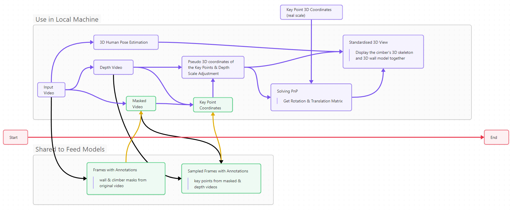

# ✅ Overview

A tool to provide 3D views of attempts to MoonBoard [MoonBoard](https://moonclimbing.com/moonboard) climbing video taken without a tripod or camera calibrations.

# ✅ Motivations

I believe that climbers need to have ...

1. Scientific knowledge (Physics, Exercise Physiology, etc.)

2. Observation skills (Learn from previous / others attempts)

3. Ability to achieve the moves they imagined

There are professional climbing coaches who know how to improve all of the three points. But, isn't it great if we could easily revise our attempts by ourselves? The first step is to create a tool to support climbers with getting insight on especially points 1 and 2 for general bouldering attempts; I would like to start with a simplified version. The famous MoonBoard is one of the standardised training walls, and climbers from all over the globe share its problems. I want to create a tool that analyses the submitted climbing video in extrapolated 3D space, comparing it with other climbers' attempts. Also, this tool should allow climbers to compare their past attempts to track their progress.

# ✅ This Application Provides ... 

### (almost done. Works in the local environment only)

3D view of the climber and the wall

## Video trimming and Depth Estimation

## Background Masking

## Key Point Detection (under development)

# 🚀 Ideas

- Make the MVP available for climbers with the shared storage to gather training dataset

- Contact states of the hands and feet on the wall

- Physical quantities (momentum, speed, holding time, contact forces, impulse, etc.)

- Muscle contraction estimation (deep learning or analytical, maybe?)

- Create the same tool for other standardised walls (not only for training walls but also for competition walls, e.g. speed wall, [TITAN](https://epclimbing.com/en/products/boulder-titan-ifsc-official) wall)